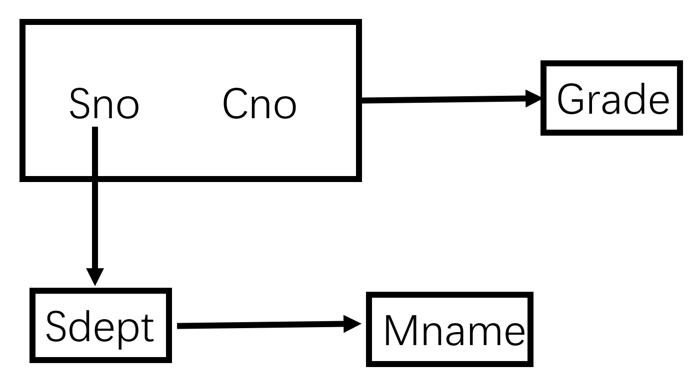
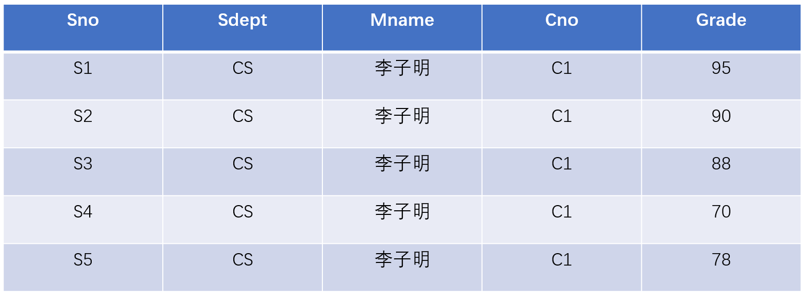

### 关系型数据库

#### 一、什么是数据库，为什么会产生数据库

&emsp;&emsp;原来人们都是使用文件来存储数据。对于普通的数据还好，但是最后由于数据量的庞大以及最后的无结构数据的情况越来越多，导致查询和管理数据相当不方便。最后直接就导致了数数据库的产生。具体也有很多渊源，从最开始的树形存储以及其他的图存储等，到后来的以mysql为代表的关系型数据库的出现以及产生，近几年比较火的no-sql的非关系型数据库，反而采用键值对的形式对数据进行存储。

#### 二、数据模型

现实世界		`数据模型`	信息世界		``	机器世界

##### （一）（包括）概念模型

$概念模型\begin{cases} 实体（“类名”）\\ 属性（“属性”）\\ 码（能够唯一标识实体的值）\\ 实体型（“类和她的属性”）\\ 实体集（“类内的成员集合”）\\ 联系（就是类之间的关系）\end{cases}$

> 注意：联系在这里主要是一对一、一对多以及多对多的关系。

#####（二）数据模型的组成

数据模型的组成主要是以下三部分：

+ 数据结构：也就是数据之间的关系
+ 数据操作：数据的增删改查的操作
+ 数据完整性约束：主要是针对属性的范围——例如：人的年龄不能超过150岁等等这样的一些约束

##### （三）关系型数据库

+ 关系（就是数据表）
+ 元组（行）
+ 属性（列）
+ 码（关键字）
+ 域（列属性的数值的集合）
+ 分量（元组中的一个属性值）
+ 关系模型（用来简单表示一张表）

> 关系模型要求关系必须规范化，最基本的一条就是：
>
> 每一个元组必须是最小的，不可分的。关系的每个属性也是不可分割的
>
> <table>
>     <tr>
>         <td rowspan="2">
职工ID
</td>
>         <td rowspan="2">
姓名
</td>
>         <td colspan="3">
工资
</td>
>     </tr>
>     <tr>
>         <td>
基本工资
</td>
>         <td>
岗位津贴
</td>
>         <td>
业绩津贴
</td>
>     </tr>
> </table>
>
> 这就不符合规范化的要求

#### 三、关系型数据库

定义一个集合操作：笛卡尔积

> $D_1\times D_2\times D_3\times \cdots \times D_n = \{(d_1, d_2, d_3,\cdots, d_n)| d_i\in D_i , i = 1, 2, \cdots, n\}$

【概念】候选码

&emsp;&emsp;如果关系中的某属性的值能够唯一地标识一个元组，而它的子集不能，那么这个属性组集合称为候选码。在候选码中任取一个称为主键。

> 换而言之，候选码就是属性值中最小的唯一属性码的集合

【概念】外码（外键）

&emsp;&emsp;在两个数据表存在某种关系的时候（比如一对一、一对多、多对多等），从而在数据库设计的时候将其中某一个表的主键放到另一个表中充当的一个属性叫做外键。（不准确的定义）

##### （一）数据操作

&emsp;&emsp;因为关系型数据库的数据结构是关系，也就是表。因此我们对于数据的操作总体来说是增、删、改、查，我们的重点主要放在查询上。

&emsp;&emsp;查询的操作主要有选择、投影、链接、除法、并、差、交、笛卡尔积。主要的精力放在选择、投影、并、差、笛卡尔积上。

##### （二）数据完整性

+ 实体完整性：主码不能为空
+ 参照完整性：外码取值为空或者只能取所限定的值
+ 用户定义

#### 四、关系代数

&emsp;&emsp;由于关系型数据库的数据结构是表，也算是集合的一种，因此主要的运算可大致分为两类：

R

<table>
    <tr>
        <td>
A
</td>
        <td>
B
</td>
        <td>
C
</td>
    </tr>
    <tr>
        <td>
a1
</td>
        <td>
b1
</td>
        <td>
c1
</td>
    </tr>
    <tr>
        <td>
a1
</td>
        <td>
b2
</td>
        <td>
c2
</td>
    </tr>
    <tr>
        <td>
a2
</td>
        <td>
b2
</td>
        <td>
c1
</td>
    </tr>
</table>

S

<table>
    <tr>
        <td>
A
</td>
        <td>
B
</td>
        <td>
C
</td>
    </tr>
    <tr>
        <td>
a1
</td>
        <td>
b2
</td>
        <td>
c2
</td>
    </tr>
    <tr>
        <td>
a1
</td>
        <td>
b3
</td>
        <td>
c2
</td>
    </tr>
    <tr>
        <td>
a2
</td>
        <td>
b2
</td>
        <td>
c1
</td>
    </tr>
</table>

#####（一）传统的集合运算

###### 1. 并

$R\cup S = \{t\mid t \in R \vee t \in S\}$

R&cup;S

<table>
    <tr>
        <td>
A
</td>
        <td>
B
</td>
        <td>
C
</td>
    </tr>
    <tr>
        <td>
a1
</td>
        <td>
b1
</td>
        <td>
c1
</td>
    </tr>
    <tr>
        <td>
a1
</td>
        <td>
b2
</td>
        <td>
c2
</td>
    </tr>
    <tr>
        <td>
a2
</td>
        <td>
b2
</td>
        <td>
c1
</td>
    </tr>
    <tr>
        <td>
a1
</td>
        <td>
b3
</td>
        <td>
c2
</td>
    </tr>
</table>

###### 2.差

$R - S = \{t\mid t \in R \wedge t \notin S\}$

R-S

<table>
    <tr>
        <td>
A
</td>
        <td>
B
</td>
        <td>
C
</td>
    </tr>
    <tr>
        <td>
a1
</td>
        <td>
b1
</td>
        <td>
c1
</td>
    </tr>
</table>

###### 3.交

$R\cap S = \{t \mid t\in R \wedge t \in S\}$

R&cap;S

<table>
    <tr>
        <td>
A
</td>
        <td>
B
</td>
        <td>
C
</td>
    </tr>
    <tr>
        <td>
a1
</td>
        <td>
b2
</td>
        <td>
c2
</td>
    </tr>
    <tr>
        <td>
a2
</td>
        <td>
b2
</td>
        <td>
c1
</td>
    </tr>
</table>

###### 4.笛卡尔积

$R\times S = \{(t_r, t_s)\mid t_r\in R\wedge t_s\in S\}$

R&times;S

<table>
    <tr>
        <td>
R.A
</td>
        <td>
R.B
</td>
        <td>
R.C
</td>
        <td>
S.A
</td>
        <td>
S.B
</td>
        <td>
S.C
</td>
    </tr>
    <tr>
        <td>
a1
</td>
        <td>
b1
</td>
        <td>
c1
</td>
        <td>
a1
</td>
        <td>
b2
</td>
        <td>
c2
</td>
    </tr>
    <tr>
        <td>
a1
</td>
        <td>
b1
</td>
        <td>
c1
</td>
        <td>
a1
</td>
        <td>
b3
</td>
        <td>
c2
</td>
    </tr>
    <tr>
        <td>
a1
</td>
        <td>
b1
</td>
        <td>
c1
</td>
        <td>
a2
</td>
        <td>
b2
</td>
        <td>
c1
</td>
    </tr>
    <tr>
        <td>
a1
</td>
        <td>
b2
</td>
        <td>
c2
</td>
        <td>
a1
</td>
        <td>
b2
</td>
        <td>
c2
</td>
    </tr>
    <tr>
        <td>
a1
</td>
        <td>
b2
</td>
        <td>
c2
</td>
        <td>
a1
</td>
        <td>
b3
</td>
        <td>
c2
</td>
    </tr>
    <tr>
        <td>
a1
</td>
        <td>
b2
</td>
        <td>
c2
</td>
        <td>
a2
</td>
        <td>
b2
</td>
        <td>
c1
</td>
    </tr>
    <tr>
        <td>
a2
</td>
        <td>
b2
</td>
        <td>
c1
</td>
        <td>
a1
</td>
        <td>
b2
</td>
        <td>
c2
</td>
    </tr>
    </tr>
    <tr>
        <td>
a2
</td>
        <td>
b2
</td>
        <td>
c1
</td>
        <td>
a1
</td>
        <td>
b3
</td>
        <td>
c2
</td>
    </tr>
    <tr>
        <td>
a2
</td>
        <td>
b2
</td>
        <td>
c1
</td>
        <td>
a2
</td>
        <td>
b2
</td>
        <td>
c1
</td>
    </tr>
</table>

#####（二）专门的集合运算

###### 1.选择（选行）

选择是从关系R中选择满足给定条件的诸元组。

$$\sigma _F(R) = \{t\mid t\in R\wedge F(t) = true\}$$

> 注意，此处的F是一个条件选择函数
>
> 例：$\sigma_{A = 'a1'}(R) $的结果如下：
>
> 
&sigma;A="a1"(R)

> <table>
>     <tr>
>         <td>
A
</td>
>         <td>
B
</td>
>         <td>
C
</td>
>     </tr>
>     <tr>
>         <td>
a1
</td>
>         <td>
b1
</td>
>         <td>
c1
</td>
>     </tr>
>     <tr>
>         <td>
a1
</td>
>         <td>
b2
</td>
>         <td>
c2
</td>
>     </tr>
> </table>

###### 2.链接

链接是从两个关系的笛卡尔积中选取属性间满足一定条件的元组。

$\mathop{R⋈S}\limits_{A\theta B} ^ {}= \{\overset{\LARGE{\frown}}{t_rt_s} \mid t_s \in R\wedge t_s \in S \wedge t_r[A]\theta t_s[B] \}$

R

<table>
    <tr>
        <td>
A
</td>
        <td>
B
</td>
        <td>
C
</td>
    </tr>
    <tr>
        <td>
a1
</td>
        <td>
b1
</td>
        <td>
5
</td>
    </tr>
    <tr>
        <td>
a1
</td>
        <td>
b2
</td>
        <td>
6
</td>
    </tr>
    <tr>
        <td>
a2
</td>
        <td>
b3
</td>
        <td>
8
</td>
    </tr>
    <tr>
        <td>
a2
</td>
        <td>
b4
</td>
        <td>
12
</td>
    </tr>
</table>

S

<table>
    <tr>
        <td>
B
</td>
        <td>
E
</td>
    </tr>
    <tr>
        <td>
b1
</td>
        <td>
3
</td>
    </tr>
    <tr>
        <td>
b2
</td>
        <td>
7
</td>
    </tr>
    <tr>
        <td>
b3
</td>
        <td>
10
</td>
    </tr>
    <tr>
        <td>
b3
</td>
        <td>
2
</td>
    </tr>
    <tr>
        <td>
b5
</td>
        <td>
2
</td>
    </tr>
</table>

R⋈S (R.B = S.B)

<table>
    <tr>
        <td>
A
</td>
        <td>
R.B
</td>
        <td>
C
</td>
        <td>
S.B
</td>
        <td>
E
</td>
    </tr>
    <tr>
        <td>
a1
</td>
        <td>
b1
</td>
        <td>
5
</td>
        <td>
b1
</td>
        <td>
3
</td>
    </tr>
    <tr>
        <td>
a1
</td>
        <td>
b2
</td>
        <td>
6
</td>
        <td>
b2
</td>
        <td>
7
</td>
    </tr>
    <tr>
        <td>
a2
</td>
        <td>
b3
</td>
        <td>
8
</td>
        <td>
b3
</td>
        <td>
10
</td>
    </tr>
    <tr>
        <td>
a2
</td>
        <td>
b3
</td>
        <td>
8
</td>
        <td>
b3
</td>
        <td>
2
</td>
    </tr>
</table>

【概念】等值连接、非等值连接、自然连接、外连接（左、右）

###### 3.投影（选列）

投影是从R选择出若干属性列组成的新的关系。

$\Pi_A(R) = \{t[A] \mid t \in R\}$

> 注意：A是R的属性列
>
> 例：$\Pi_{A, B}(R)$的结果为：
>
> 
&pi;A,B(R)

> <table>
>     <tr>
>         <td>
A
</td>
>         <td>
B
</td>
>     </tr>
>     <tr>
>         <td>
a1
</td>
>         <td>
b1
</td>
>     </tr>
>     <tr>
>         <td>
a1
</td>
>         <td>
b2
</td>
>     </tr>
>     <tr>
>         <td>
a2
</td>
>         <td>
b2
</td>
>     </tr>
> </table>

###### 4.除法

#### 五、SQL

#### 六、数据库设计

#####（一）数据库设计的理论模型

&emsp;&emsp;一般来说，我们可以将一个关系模型表示为以下的一个**五元组**，——$R(U,D, DOM, F)$

其中五元组中的各项的含义是：

> R：关系名
>
> U：是一组属性
>
> D：是属性U来自的域（从数学中函数角度上相当于是“定义域”）
>
> DOM：是属性到域的映射集合（相当于是数学中函数角度上的“值域”）
>
> F：就是属性U上的一组数据依赖（可以理解为一些属性能够决定另外的属性的关系）

&emsp;&emsp;但是在数据库的设计当中，D和DOM对设计关系影响不大，因此五元组编程**三元组**——$R(U, F)$

&emsp;&emsp;【数据依赖】具体什么叫数据依赖呢？就是关系内部属性与属性之间的制约关系。主要包含以下两种依赖关系：**函数依赖**和**多值依赖**。

###### 1.函数依赖

&emsp;&emsp;这种依赖关系类似于函数中的$y = f(x)$这样的关系，某些属性能够被其他的属性唯一决定。

> e.g. ：比如一个学生表，其中的属性有：学号($Sno$)、姓名($Sname$)、所在系($Sdept$)等几个属性。在现实生活中，由于学号是唯一的，因此学号一旦确定，那么该学生的姓名和院系都能被确立下来。即可以表示为以下的形式$Sno \rightarrow Sname, Sdept$ 

###### 2.多值依赖

##### （二）关系的规范化

&emsp;&emsp;我们通过一个例子来研究数据表为什么需要规范化：

> 建立一个学校教务系统的数据库，涉及到的对象包括学生的学号($Sno$)、所在系($Sdept$)、系主任姓名($Mname$)、课程号($Cno$)和成绩($Grade$)。

&emsp;&emsp;考虑以上的关系模型，属性U的集合为$U = \{Sno, Sdept, Mname, Cno, Grade\}$ 然后我们接着分析数据依赖。现实生活中，我们知道的关系是：

> $Sno \rightarrow Sdept\\Sdept\rightarrow Mname\\Sno,Cno \rightarrow Grade$

&emsp;&emsp;但是，这样的表会造成以下的后果——

&emsp;&emsp;看到这样的一张表，我们会发现存在以下的很多问题：

【问题1】数据冗余

&emsp;&emsp;比如该表中的系主任名称大量出现，浪费大量空间。

【问题2】更新异常

&emsp;&emsp;由于数据冗余，一旦想要更新系主任名称就必须把与该系主任相关的所有元组全部更新。

【问题3】插入异常

&emsp;&emsp;当一个系刚刚成立的时候，还没有学生，这个时候是无法将系主任加入到表中的。

【问题4】删除异常

&emsp;&emsp;如果一个系的全部学生都毕业了，那么在清除数据库的时候会将这个系和系主任的信息全部丢掉。

 

&emsp;&emsp;基于以上的我们对于数据库本身的设计模式存在的问题，那么我们需要在已经建立起的数据模型上开始进行数据库中数据表的规范化。

&emsp;&emsp;接下来我们深入理解函数依赖：

> 函数依赖的定义[见上文](#fd)，接下来我们来看具体的函数依赖关系
>
> 【定义一】设$R(U)$是属性集$U$上的关系模式，$X, Y$是$U$的子集。若对于$R(U)$的任意一个可能的关系$r$，$r$中不可能存在两个元组在$X$上的属性值相等，而在$Y$上的属性值不等，那么就称$X$函数确定$Y$或者$Y$函数依赖于$X$，记作$X\rightarrow Y$。也就是说，X中的属性一旦确定，Y的属性也被确定
>
> 【定义二】在$R(U)$中，如果$X\rightarrow Y$，并且对于$X$的任何一个真子集$X^\prime$，都有$X^\prime \nrightarrow Y$，则称$Y$对$X$完全函数依赖，记$X\stackrel{F}{\rightarrow}Y$；若$X\rightarrow Y$，但$Y$不完全依赖于$X$，则称$Y$对$X$部分函数依赖，记作$X\stackrel{P}{\rightarrow}Y$。例如。[上例中](#example)的$(Sno, Cno) \stackrel{F}{\longrightarrow}Grade\quad (Sno, Cno)\stackrel{P}{\longrightarrow}Sdept$
>
> 【定义三】在$R(U)$中，如果$X\rightarrow Y(Y\nsubseteq X) $，$Y\nrightarrow X$，$Y\rightarrow Z$，$Z\nsubseteq Y$则称$Z$对$X$传递函数依赖，记为$X\stackrel{传递}{\rightarrow}Y$。例如，[上例中](#example)的$Sno\rightarrow Sdept\quad Sdept\rightarrow Mname$，所以$Sno\stackrel{传递}{\rightarrow}Mname$

######  1.第一范式（1NF）

&emsp;&emsp;作为一个二维表，每一个分量必须是不可分的数据项。满足这一条件的就属于第一范式。（也就是说含有表中表）

######2.第二范式（2NF）

###### 3.第三范式（3NF）

#### 七、模型映射算法

